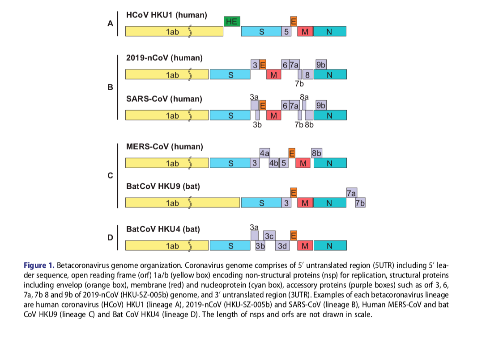

# 一些简单的科普

## 传播途径

* 飞沫传播
* 接触传播
* ~~气溶胶传播~~（有相反佐证）
* ~~粪口传播~~（有相反佐证）
* ~~结膜感染~~（佐证少）
* 母婴传播

## 潜伏期

0~24天，中位数3天

## 发病特征

### 发病人特征

* 有潜在疾病(25.2%)

* 发病年龄

  | 下四分位数 | 中位数 | 上四分位数 |
  | :--------: | :----: | :--------: |
  |     35     |   47   |     58     |

### 重症特征

* 高龄
* 潜在疾病
* 接触史无影响

### 症状

* 发烧(87.9%)
* 咳嗽(67.7%)
* 腹泻(3.7%)
* 呕吐(5.0%)

## 治疗方案

* 供氧
* 辅助呼吸(?, mechanical ventilation, 翻译求助)
* 抗生素注射
* 奥司他韦
* 皮质醇(少部分)

## 基因序列

下图展示了相关病毒的比较：

## 与SARS比较

|   比较点 |            SARS            |                          2019-nCOV                           |
| -------: | :------------------------: | :----------------------------------------------------------: |
| 发病年龄 |  年纪较轻(中位数在38~45)   |                      年龄较大(中位数47)                      |
|     症状 | 大部分有发热，近半数有腹泻 | 各类症状发生概率都不高，呈现比较微弱感染的情况，较少有腹泻症状 |
|   潜伏期 |   2-10天，极少数10-14天    |                            0~24天                            |
|   致死率 |          接近10%           |                 6.10%送往ICU、辅助呼吸或死亡                 |

## 参考文献

Guan, W.-j., et al. (2020). "Clinical characteristics of 2019 novel coronavirus infection in China." medRxiv.

Chan, J. F., et al. (2020). "Genomic characterization of the 2019 novel human-pathogenic coronavirus isolated from a patient with atypical pneumonia after visiting Wuhan." Emerg Microbes Infect **9**(1): 221-236.

Skowronski, D. M., et al. (2005). "Severe acute respiratory syndrome (SARS): a year in review." Annu Rev Med **56**: 357-381.